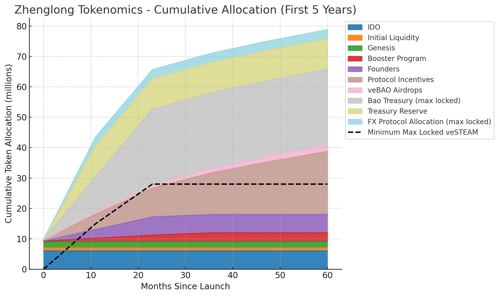

# STEAM Token

**STEAM** is the native governance, incentive, and revenue-sharing token of the Zhenglong ecosystem. It plays a central role in coordinating the protocol's growth, securing market health, and rewarding community participation.

## Overview

STEAM turns users, builders, and liquidity providers into long-term stakeholders aligned with Zhenglong's success through multiple utilities:

- Governance power through veSTEAM (vote-escrowed STEAM)
- Boosting rewards in Stability Pools and liquidity provision
- Protocol revenue sharing and redistribution
- Control over emissions and incentives via gauge voting
- Alignment of long-term interests with the protocol's success

## Token Utilities

### 1. Governance Power (veSTEAM)

STEAM holders who lock their tokens as **veSTEAM** gain the ability to:

- Vote on new incentivized market launches
- Direct incentive emissions toward Stability Pools, liquidity pools, or strategic initiatives
- Influence protocol parameters like minimum collateral ratios and fee structures
- Direct protocol revenue
- Participate in gauge voting to determine where incentives flow

The longer the STEAM is locked, the more veSTEAM is received, and the greater the governance power.

### 2. Boosted Rewards

- veSTEAM holders receive **boosted returns** on Stability Pool deposits and liquidity provision
- Lock duration affects boost multipliers - longer locks provide greater benefits
- Enhance yields across all protocol participation
- Access premium features and advance governance weight

### 3. Revenue Sharing

- Portions of protocol revenue — including minting fees, redemption fees, and yield from yield-bearing collateral — are shared with veSTEAM lockers
- veSTEAM holders can vote on directing fee allocation
- Revenue increases with protocol adoption and usage
- Provides sustainable, non-inflationary returns

### 4. Gauge Voting System

- Governance is conducted through a **gauge voting model**
- veSTEAM holders vote on how emissions are distributed across different Stability Pools and markets
- Dynamically allocates incentives based on community priorities and market demand
- Enables flexible adaptation to changing market conditions

## Locking STEAM for veSTEAM

- **Maximum Lock Duration**: 1 year (12 months) is the maximum lock period
- **Linear veSTEAM Calculation**: The amount of veSTEAM you receive increases linearly based on your lock length:
  - 3 months lock = 0.25 veSTEAM per locked STEAM
  - 6 months lock = 0.5 veSTEAM per locked STEAM
  - 9 months lock = 0.75 veSTEAM per locked STEAM
  - 12 months lock = 1 veSTEAM per locked STEAM (maximum)
- **Voting Power**: Longer locks grant proportionally higher voting power and greater share of rewards
- **Decaying Locks**: Lock time gradually decreases over time unless renewed
- **Alignment Incentives**: Users who lock STEAM align their interests with the long-term health and growth of Zhenglong

### veSTEAM Lock Duration

The relationship between lock duration and veSTEAM received is directly proportional. Locking for the maximum duration of 12 months provides the maximum benefit of 1 veSTEAM per STEAM locked.

## Tokenomics

Zhenglong is built to reward long-term participation, decentralize governance, and create sustainable liquidity incentives. All token allocations are transparently structured and time-released.

**Total Supply:** 100,000,000 $STEAM

| Category                  | Allocation | Vesting / Notes                                                                                         |
| ------------------------- | ---------- | ------------------------------------------------------------------------------------------------------- |
| 🏦 Bao Treasury           | 25%        | Vested linearly over 24 months. Max locked as veSTEAM.                                                  |
| 📦 Treasury Reserve       | 10%        | Vested linearly over 12 months. Protocol-controlled.                                                    |
| 🤝 FX Protocol Allocation | 3%         | Vested linearly over 12 months. Max locked as veSTEAM.                                                  |
| 🚀 IDO                    | 6%         | Fully liquid at TGE, distributed via community + public rounds.                                         |
| 💧 Initial Liquidity      | 1%         | Deployed immediately on launch.                                                                         |
| 🌱 Genesis Contributors   | 2%         | Rewards for initial liquidity providers.                                                                |
| 📣 Booster Program        | 3%         | Distributed over 3 years (0.27% TGE, 1% Y1, 1% Y2, 0.73% Y3).                                           |
| 🧑‍💻 Founders               | 6%         | Vested linearly over 24 months.                                                                         |
| 🌊 Protocol Incentives    | 39%        | 5M tokens distributed linearly in Year 1, then decaying 12.9% per year after. 100+ years to fully emit. |
| 🎁 veBAO Airdrops         | 5%         | 500k tokens in Year 1, decreasing 10% annually. Similar schedule to protocol incentives                 |

---

## 🔒 Locked Governance Supply

The Bao Treasury and FX Protocol Allocation are both committed to permanent max lock as veSTEAM once vested.

These make up a minimum of **28% of the token supply** that is guaranteed to be locked and actively contributing to protocol governance and emission direction.

_On the chart, this is shown as an overlay line labeled:_

> 🟢 Minimum locked as veSTEAM (Bao + FX Protocol)

---

## 📉 Emissions Logic

**Protocol Incentives (39%)**

- Year 1: 5,000,000 tokens emitted linearly
- Following years: each emits 12.9% less than the year before
- Modeled after Curve's emissions: decaying emissions with a long tail
- Emission lifespan: 100+ years

**veBAO Airdrops (5%)**

- Year 1: 500,000 tokens (linear)
- Each subsequent year emits 10% less than the year before
- Also spans 100+ years
- Designed to reward long-term aligned governance holders

---

## 📊 STEAM 5 Year Emissions

This chart shows:

- 📦 Cumulative token release over the first 5 years
- 🟩 Stacked areas for each allocation category
- 🔒 An overlay line for the minimum number of max-locked veSTEAM tokens from the Bao and FX Protocol allocations

The categories with immediate or early liquidity — IDO, Initial Liquidity, and Genesis — appear at the base for clarity.

_All values are linear unless stated otherwise. No cliffs. No surprise unlocks._

## Earning STEAM

Users can earn STEAM through various protocol activities:

1. **Stability Pools**

   - Deposit assets into either Collateral or Steamed Stability Pools
   - Earn base rewards according to gauge voting
   - Boost rewards with veSTEAM locks

2. **Genesis Vault Participation**

   - Help bootstrap new markets through Genesis Vaults
   - Receive STEAM rewards for early support
   - Distribute risk and initial tokens

3. **Liquidity Provision**

   - Provide AMM liquidity for protocol tokens
   - Earn trading fees and STEAM rewards
   - Boost rewards with veSTEAM

4. **Governance Participation**
   - Lock STEAM for veSTEAM
   - Vote on emissions and gauges
   - Direct protocol development
   - Participate in governance forums
   - Earn revenue

✅ **Decentralized Ownership**: Broad distribution across participants, governance, and builders

✅ **Alignment of Incentives**: STEAM holders benefit from real protocol revenue and protocol growth

✅ **Ultra-Long-Term Design**: 100+ year emissions curve prevents mercenary behavior and supports multi-decade DeFi expansion

The STEAM token isn't just an incentive — it's the governance, growth engine, and heartbeat of Zhenglong's emerging synthetic asset ecosystem.
