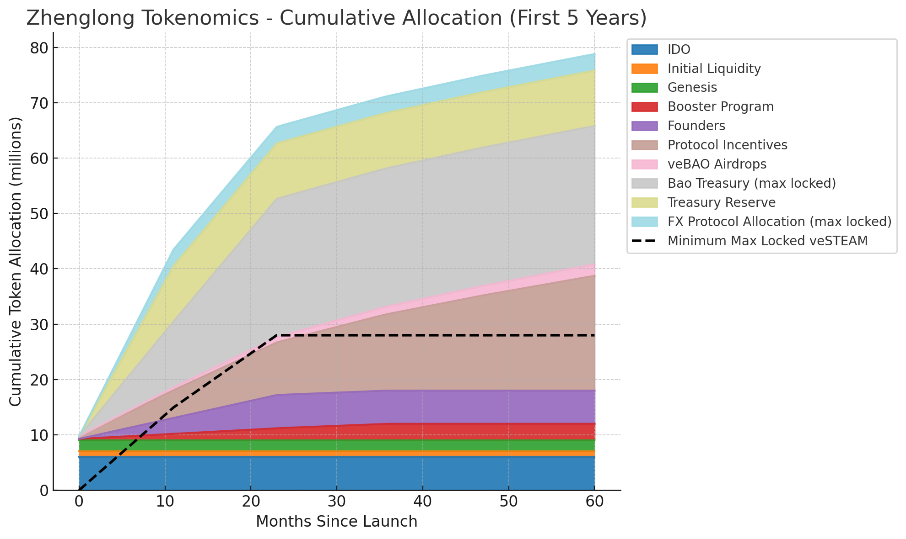

# STEAM Tokenomics

Zhenglong is built to reward long-term participation, decentralize governance, and create sustainable liquidity incentives. All token allocations are transparently structured and time-released.

**Total Supply:** 100,000,000 $STEAM

| Category                  | Allocation | Vesting / Notes                                                                                         |
| ------------------------- | ---------- | ------------------------------------------------------------------------------------------------------- |
| 🏦 Bao Treasury           | 25%        | Vested linearly over 24 months. Max locked as veSTEAM.                                                  |
| 📦 Treasury Reserve       | 10%        | Vested linearly over 12 months. Protocol-controlled.                                                    |
| 🤝 FX Protocol Allocation | 3%         | Vested linearly over 12 months. Max locked as veSTEAM.                                                  |
| 🚀 IDO                    | 6%         | Fully liquid at TGE, distributed via community + public rounds.                                         |
| 💧 Initial Liquidity      | 1%         | Deployed immediately on launch.                                                                         |
| 🌱 Genesis Contributors   | 2%         | Rewards for initial liquidity providers.                                                                |
| 📣 Booster Program        | 3%         | Distributed over 3 years (0.27% TGE, 1% Y1, 1% Y2, 0.73% Y3).                                           |
| 🧑‍💻 Founders               | 6%         | Vested linearly over 24 months.                                                                         |
| 🌊 Protocol Incentives    | 39%        | 5M tokens distributed linearly in Year 1, then decaying 12.9% per year after. 100+ years to fully emit. |
| 🎁 veBAO Airdrops         | 5%         | 500k tokens in Year 1, decreasing 10% annually. Similar schedule to protocol incentives                 |

---

## 🔒 Locked Governance Supply

The Bao Treasury and FX Protocol Allocation are both committed to permanent max lock as veSTEAM once vested.

These make up a minimum of **28% of the token supply** that is guaranteed to be locked and actively contributing to protocol governance and emission direction.

_On the chart, this is shown as an overlay line labeled:_

> 🟢 Minimum locked as veSTEAM (Bao + FX Protocol)

---

## 📉 Emissions Logic

**Protocol Incentives (39%)**

- Year 1: 5,000,000 tokens emitted linearly
- Following years: each emits 12.9% less than the year before
- Modeled after Curve's emissions: decaying emissions with a long tail
- Emission lifespan: 100+ years

**veBAO Airdrops (5%)**

- Year 1: 500,000 tokens (linear)
- Each subsequent year emits 10% less than the year before
- Also spans 100+ years
- Designed to reward long-term aligned governance holders

---

## 📊 STEAM 5 Year Emissions

This chart shows:

- 📦 Cumulative token release over the first 5 years
- 🟩 Stacked areas for each allocation category
- 🔒 An overlay line for the minimum number of max-locked veSTEAM tokens from the Bao and FX Protocol allocations

The categories with immediate or early liquidity — IDO, Initial Liquidity, and Genesis — appear at the base for clarity.

_All values are linear unless stated otherwise. No cliffs. No surprise unlocks._

